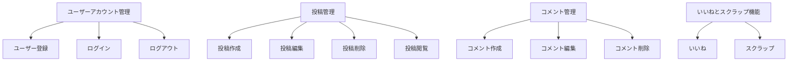
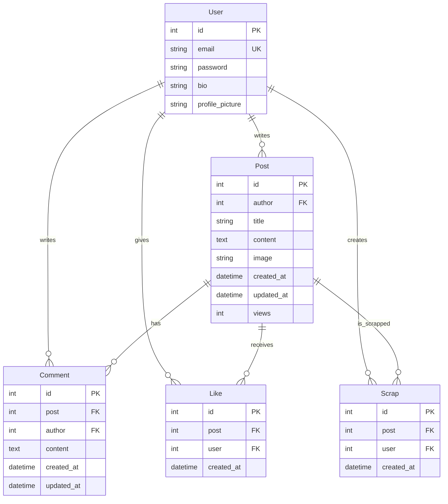

# モダンファミリー ファンコミュニティ

## 目標と機能
### 目標 ###
アメリカのシットコム「モダンファミリー」のファンコミュニティサイトとして、ユーザーが投稿を作成し、コメントを投稿し、「いいね」や「スクラップ」機能を通じて自分だけのコミュニティ体験を提供します。

### 機能
- 会員登録およびログイン/ログアウト: ユーザーはメールアドレスとパスワードを使用してアカウントを作成し、ログインおよびログアウトできます。
- 投稿管理: ユーザーは投稿を作成、編集、削除できます。
- コメント管理: 投稿にコメントを追加、編集、削除できます。
- いいね機能: ユーザーは投稿に「いいね」を押して関心を示すことができます。
- スクラップ機能: ユーザーは投稿をスクラップし、お気に入りに追加できます。

## リポジトリ
https://github.com/jsyoo1229/modern_family_fan_community

## 使用技術
**フロントエンド** 
 

**バックエンド** 
 

**データベース** 

**API** 

**プロジェクト管理** 

## プロジェクトフォルダ構造
📂modern_family_fan_community  
┣ 📂config  
┣ 📂frontend  
┃ ┣ 📂migrations  
┃ ┣ 📂node_modules  
┃ ┣ 📂public  
┃ ┣ 📂src  
┃ ┃ ┣ 📂assets  
┃ ┃ ┣ 📂components  
┃ ┃ ┣ 📂pages  
┃ ┃ ┣ 📜 App.css  
┃ ┃ ┣ 📜 App.js  
┃ ┃ ┣ 📜 index.js  
┃ ┣ 📂static  
┃ ┣ 📜 _init_.py  
┃ ┣ 📜 admin.py  
┃ ┣ 📜 apps.py  
┃ ┣ 📜 babel.config.json  
┃ ┣ 📜 models.py  
┃ ┣ 📜 package-lock.json  
┃ ┣ 📜 package.json  
┃ ┣ 📜 tests.py  
┃ ┣ 📜 views.py  
┃ ┣ 📜 webpack.config.js  
┣ 📂media  
┃ ┣ 📂post_images  
┣ 📂node_modules  
┣ 📂posts  
┃ ┣ 📜 models.py  
┃ ┣ 📜 serializers.py  
┃ ┣ 📜 tests.py  
┃ ┣ 📜 urls.py  
┃ ┣ 📜 views.py  
┣ 📂users  
┃ ┣ 📜 models.py  
┃ ┣ 📜 serializers.py  
┃ ┣ 📜 tests.py  
┃ ┣ 📜 urls.py  
┃ ┣ 📜 views.py  
┣ 📂shows  
┃ ┣ 📜 models.py  
┃ ┣ 📜 serializers.py  
┃ ┣ 📜 tests.py  
┃ ┣ 📜 urls.py  
┃ ┣ 📜 views.py  
┣ 📂static  
┣ 📂staticfiles  
┣ 📂venv  
┣ 📜 manage.py  
┣ 📜 requirements.txt  
┣ 📜 .gitignore  
┣ 📜 db.sqlite3  
┣ 📜 package-lock.json  
┣ 📜 package.json  

## URL構造 ##

* **config**

| App    | URL                        | 説明                           |
|--------|----------------------------|--------------------------------|
| config | /login/                    | ユーザーログイン (JWTトークン発行) |
| config | /admin/                    | Django管理ページ               |
| config | /api/schema/               | APIスキーマ                     |
| config | /api/schema/swagger-ui/    | Swagger UI                     |
| config | /api/schema/redoc/         | Redoc UI                       |

* **posts**

| App   | URL                         | HTTP METHOD | 説明                                       |
|-------|-----------------------------| ------------|-------------------------------------------|
| posts | /posts/                     | GET         | 投稿リストを取得                           |
| posts | /posts/                     | POST        | 投稿作成                                   |
| posts | /posts/{id}/                | GET         | 特定の投稿を取得                           |
| posts | /posts/{id}/                | PUT         | 特定の投稿を更新                           |
| posts | /posts/{id}/                | DELETE      | 特定の投稿を削除                           |
| posts | /posts/{post_id}/comments/  | GET         | 特定の投稿のコメントリストを取得             |
| posts | /posts/{post_id}/comments/  | POST        | 特定の投稿にコメントを追加                  |
| posts | /posts/{post_id}/like/      | POST        | 投稿にいいねを追加                          |
| posts | /posts/{post_id}/like/      | DELETE      | 投稿のいいねを解除                          |
| posts | /posts/{post_id}/like/      | GET         | ユーザーが投稿にいいねを押したか確認         |
| posts | /posts/{post_id}/scrap/     | POST        | 投稿をスクラップ                            |
| posts | /posts/{post_id}/scrap/     | GET         | ユーザーが投稿をスクラップしたか確認         |
| posts | /posts/top_liked/           | GET         | いいねが多い上位7つの投稿を取得              |
| posts | /posts/top_viewed/          | GET         | 閲覧数が多い上位5つの投稿を取得              |

* **users**

| App   | URL                      | HTTP METHOD | 説明                                      |
|-------|--------------------------|-------------|-------------------------------------------|
| users | /users/signup/           | POST        | ユーザー登録                               |
| users | /users/profile/<int:pk>/ | GET         | プロフィール取得                           |
| users | /users/scraps/           | GET         | 現在のユーザーがスクラップした投稿リストを取得 |

## 機能仕様

## データベースモデリング（ERD）

## ワイヤーフレーム
* Home

* Write a Post

* Single Post

* Posts

* Scrapped Posts

## 画面設計  
* Home

* ユーザー登録

* ログイン

* 閲覧数上位5つの投稿

* いいねが多い上位7つの投稿

* 投稿作成

* 投稿リスト

* 投稿閲覧

* コメント

* スクラップした投稿

## トラブルシューティング
* トークン認証エラー
最初はフロントエンドをバニラJavaScriptで実装しようとしましたが、認証プロセスでエラーが発生し、
デバッグが難しかったため、この機会にReactを学び、Reactでフロントエンドコードを実装することにしました。
そのため、制作期間は長くなりましたが、最終的にフロントエンドコードがうまく動作したので、正しい選択だったと思います。

## 感想
* 基本に対する理解
いいねやスクラップ機能を実装する際、DRFのビューとモデルに対する基本的な理解が不可欠でした。
継承されたクラスに内蔵されている関数を利用してカスタマイズするコードが多かったため、
どのような内蔵関数が存在するのか、モデルのどのフィールドを引数に渡すべきかなど、
基本を理解していなければ実装は難しかったです。

* CICDの失敗
プロジェクト完了後、GitHub ActionsとAWS EC2インスタンスを使用してデプロイにも挑戦しましたが、
SSH認証プロセスでエラーが発生し、デプロイに失敗しました。非常に残念でしたが、デプロイに挑戦する中で、
仮想化、Docker、コンテナといった概念について学ぶ良いきっかけとなり、Linuxのコマンドも実際に経験することができて良かったです。

  

