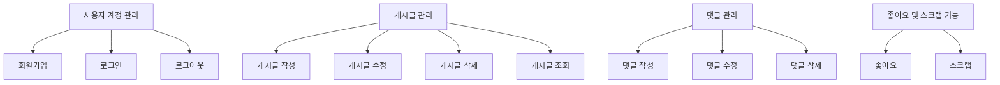
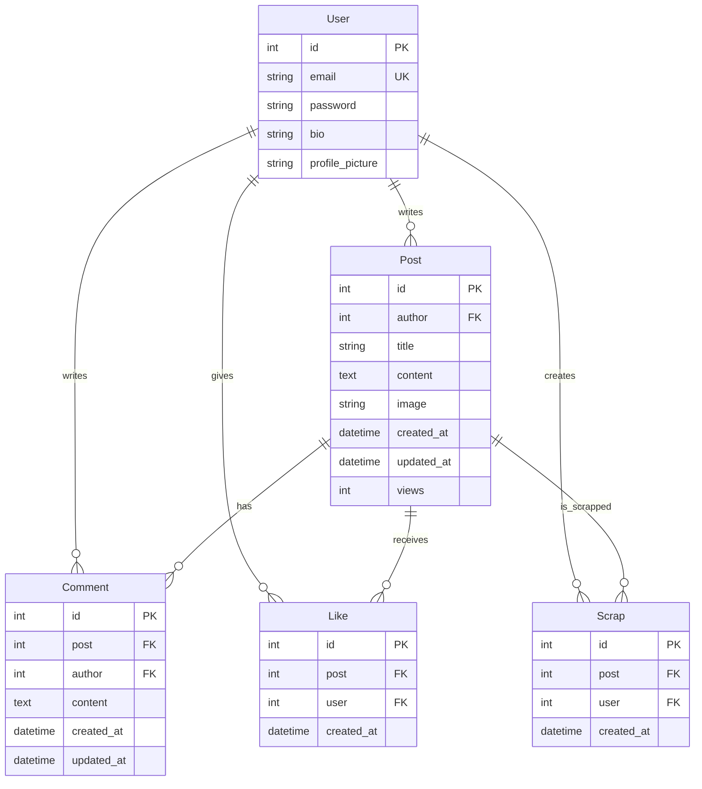

# 모던 패밀리 팬 커뮤니티

## 목표와 기능
### 목표 ###
이 프로젝트는 미국 시트콤 모던 패밀리의 팬 커뮤니티 사이트를 구축하는 것을 목표로 합니다. 사용자가 게시글을 작성하고, 댓글을 달며, 좋아요와 스크랩 기능을 통해 자신만의 커뮤니티 경험을 제공하는 것을 목표로 합니다.

### 기능
- 회원가입 및 로그인/로그아웃: 사용자는 이메일과 비밀번호를 사용해 계정을 생성하고 로그인 및 로그아웃할 수 있습니다.
- 게시글 관리: 사용자는 게시글을 생성하고, 수정 및 삭제할 수 있습니다.
- 댓글 관리: 게시글에 댓글을 작성하고, 수정 및 삭제할 수 있습니다.
- 좋아요 기능: 사용자는 게시글에 좋아요를 눌러 관심을 표현할 수 있습니다.
- 스크랩 기능: 사용자는 게시글을 스크랩하여 즐겨찾기에 추가할 수 있습니다.

## 레포지토리
https://github.com/jsyoo1229/modern_family_fan_community

## 사용 기술
**Front-end** 
 

**Back-end** 
 

**Database** 

**API** 

**Project management** 

## 프로젝트 폴더 구조
📂modern_family_fan_community  
┣ 📂config  
┣ 📂frontend  
┃ ┣ 📂migrations  
┃ ┣ 📂node_modules  
┃ ┣ 📂public  
┃ ┣ 📂src  
┃ ┃ ┣ 📂assets  
┃ ┃ ┣ 📂components  
┃ ┃ ┣ 📂pages  
┃ ┃ ┣ 📜 App.css  
┃ ┃ ┣ 📜 App.js  
┃ ┃ ┣ 📜 index.js  
┃ ┣ 📂static  
┃ ┣ 📜 _init_.py  
┃ ┣ 📜 admin.py  
┃ ┣ 📜 apps.py  
┃ ┣ 📜 babel.config.json  
┃ ┣ 📜 models.py  
┃ ┣ 📜 package-lock.json  
┃ ┣ 📜 package.json  
┃ ┣ 📜 tests.py  
┃ ┣ 📜 views.py  
┃ ┣ 📜 webpack.config.js  
┣ 📂media  
┃ ┣ 📂post_images  
┣ 📂node_modules  
┣ 📂posts  
┃ ┣ 📜 models.py  
┃ ┣ 📜 serializers.py  
┃ ┣ 📜 tests.py  
┃ ┣ 📜 urls.py  
┃ ┣ 📜 views.py  
┣ 📂users  
┃ ┣ 📜 models.py  
┃ ┣ 📜 serializers.py  
┃ ┣ 📜 tests.py  
┃ ┣ 📜 urls.py  
┃ ┣ 📜 views.py  
┣ 📂shows  
┃ ┣ 📜 models.py  
┃ ┣ 📜 serializers.py  
┃ ┣ 📜 tests.py  
┃ ┣ 📜 urls.py  
┃ ┣ 📜 views.py  
┣ 📂static  
┣ 📂staticfiles  
┣ 📂venv  
┣ 📜 manage.py  
┣ 📜 requirements.txt  
┣ 📜 .gitignore  
┣ 📜 db.sqlite3  
┣ 📜 package-lock.json  
┣ 📜 package.json  

## URL 구조 ##

* **config**

| App    | URL                        | 설명                           |
|--------|----------------------------|--------------------------------|
| config | /login/                    | 사용자 로그인 (JWT 토큰 발급)    |
| config | /admin/                    | Django 관리자 페이지            |
| config | /api/schema/               | API 스키마                      |
| config | /api/schema/swagger-ui/    | Swagger UI                     |
| config | /api/schema/redoc/         | Redoc UI                       |

* **posts**

| App   | URL                         | HTTP METHOD | 설명                                       |
|-------|-----------------------------| ------------|-------------------------------------------|
| posts | /posts/                     | GET         | 게시물 목록 조회 (리스트)                    |
| posts | /posts/                     | POST        | 게시물 생성                                 |
| posts | /posts/{id}/                | GET         | 특정 게시물 조회                            |
| posts | /posts/{id}/                | PUT         | 특정 게시물 수정                            |
| posts | /posts/{id}/                | DELETE      | 특정 게시물 삭제                            |
| posts | /posts/{post_id}/comments/  | GET         | 특정 게시물의 댓글 목록 조회                 |
| posts | /posts/{post_id}/comments/  | POST        | 특정 게시물에 댓글 생성                      |
| posts | /posts/{post_id}/like/      | POST        | 게시물에 좋아요를 추가                       |
| posts | /posts/{post_id}/like/      | DELETE      | 게시물의 좋아요 취소                         |
| posts | /posts/{post_id}/like/      | GET         | 사용자가 게시물에 좋아요를 눌렀는지 여부 확인  |
| posts | /posts/{post_id}/scrap/     | POST        | 게시물을 스크랩                             |
| posts | /posts/{post_id}/scrap/     | GET         | 사용자가 게시물을 스크랩했는지 여부 확인      |
| posts | /posts/top_liked/           | GET         | 좋아요가 많은 상위 7개의 게시물 조회          |
| posts | /posts/top_viewed/          | GET         | 조회수가 높은 상위 5개의 게시물 조회          |

* **users**

| App   | URL                      | HTTP METHOD | 설명                                      |
|-------|--------------------------|-------------|-------------------------------------------|
| users | /users/signup/           | POST        | 회원가입                                   |
| users | /users/profile/<int:pk>/ | GET         | 프로필 조회                                |
| users | /users/scraps/           | GET         | 현재 사용자의 스크랩한 게시물 목록을 조회    |

## 기능 명세 ##

## 데이터베이스 모델링(ERD)

## 와이어프레임
* Home

* Write a Post

* Single Post

* Posts

* Scrapped Posts

## 화면 설계  
* Home

* 회원가입

* 로그인

* 홈 조회수 상위 5개 게시글

* 홈 좋아요 상위 7개 게시글

* 글쓰기

* 게시글 목록

* 글 읽기

* 댓글

* 스크랩한 글 목록

## 트러블 슈팅
* 토큰 인증 오류
가장 큰 난관은 토큰 관련 오류였습니다. 회원가입과 로그인은 물론, CRUD 기능에서도 토큰

## 느낀점
* 프론트엔드 코드에 대한 기본적인 이해 필요
* 모델링과 인증 기능

